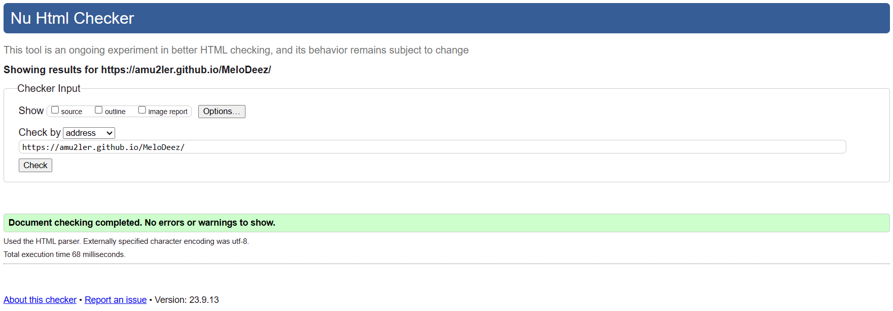
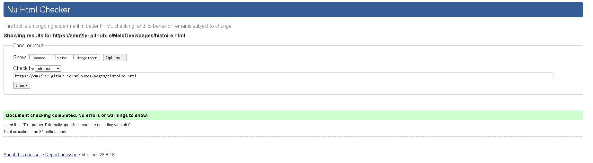
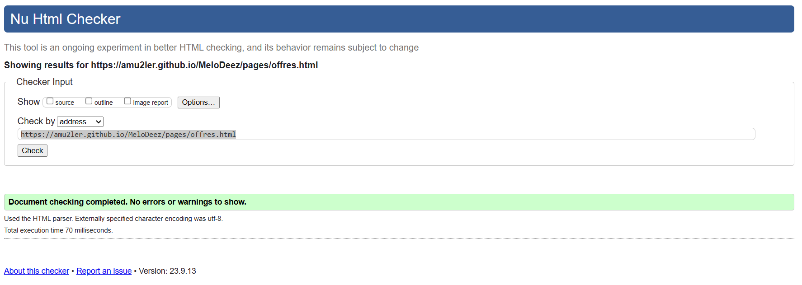
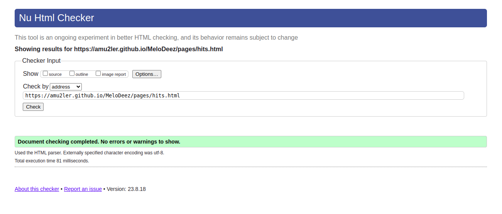
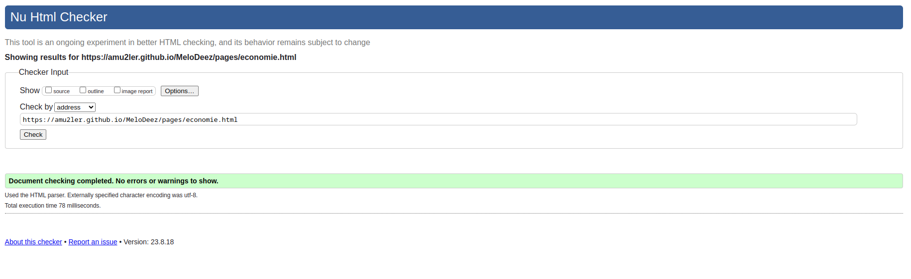
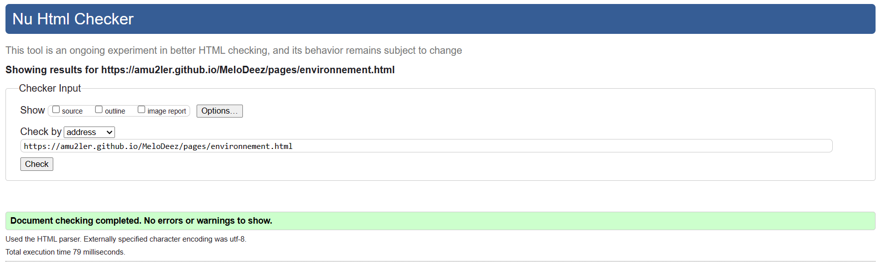
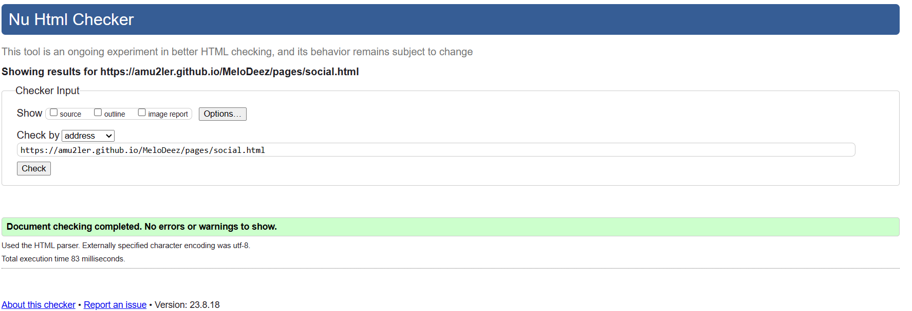
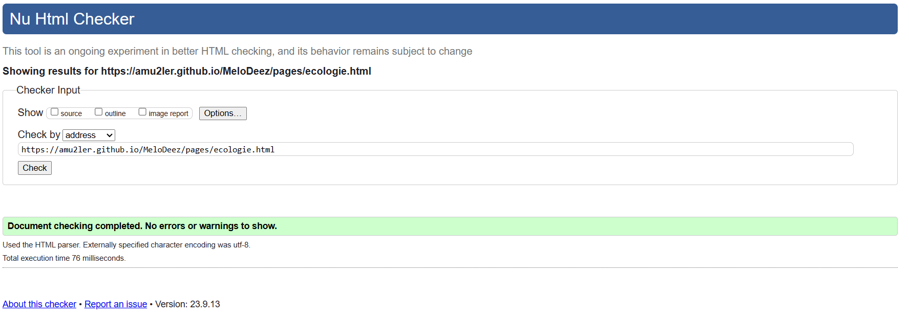
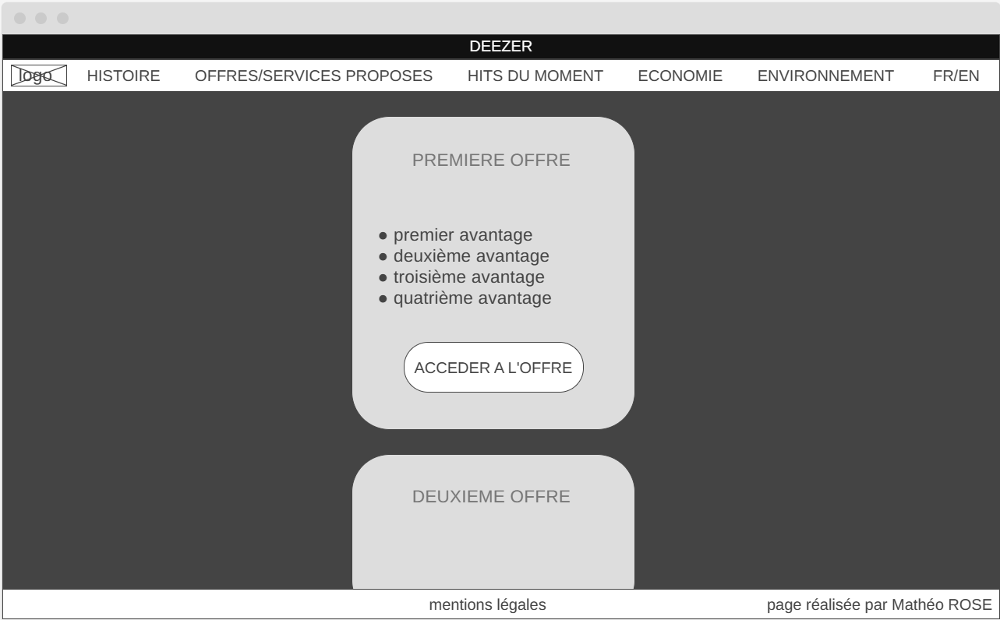
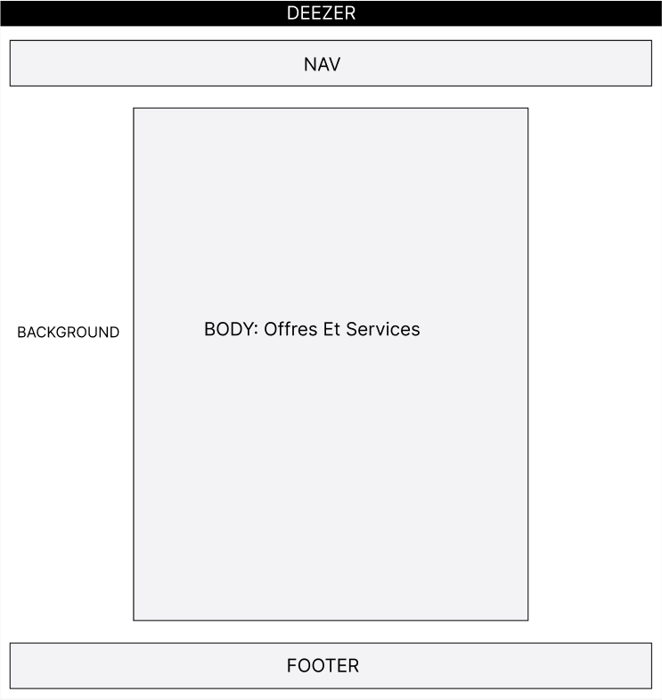

# MeloDeez

UE : SAÉ S1. 05-06 Recueil des besoins & découverte de l'environnement économique et écologique

[Accueil du site](https://amu2ler.github.io/MeloDeez/) déposé sur Github

[Accueil du site](https://melodeez-artmuller75013-e9cdd787d732077808ece91724d81c624253a30.gitlab.io) déposé sur Gitlab

[Accueil du site](https://test-arthur.bitbucket.io/) déposé sur BitBucket

 - - - - - - - - - - - - - - 
## Membres du groupe : 

MULLER Arthur (référent ; arthur.muller@edu.univ-fcomte.fr)

ROSE Mathéo

BOUCHE Natan

RICHARD Florian

 - - - - - - - - - - - - - - 

## Présentation 

Ce dépôt correspond à un site web créé en HTML/CSS/JS dans le cadre de la SAÉ 05-06 à l'IUT de Belfort-Montbéliard. Ce site présente des informations concernant l'entreprise Deezer et sert de vitrine pour présenter l'entreprise, ses activité, son organisation et son historique. Vous trouverez dans ce dépôt et sur le site un rapport économique analysant l'aspect économique de Deezer. 

## Choix de conception  

Pour la conception du site, nous nous sommes grandement inspirés du site officiel de Deezer (disponible [ici](https://www.deezer.com/fr/)) et du site d'un de ses principaux concurrents [apple music](https://www.apple.com/fr/apple-music/)

## Développement Site Web et Validation des pages

### Page d'accueil

**Auteur : ROSE Mathéo**  

Vérification W3C : [Détail ICI](https://validator.w3.org/nu/?doc=https%3A%2F%2Famu2ler.github.io%2FMeloDeez%2F)

### Page Histoire

**Auteur : MULLER Arthur & RICHARD Florian**

Vérification W3C : [Détail ICI](https://validator.w3.org/nu/?doc=https%3A%2F%2Famu2ler.github.io%2FMeloDeez%2Fpages%2Fhistoire.html)

### Page Offres

**Auteur : ROSE Mathéo**

Vérification W3C : [Détail ICI](https://validator.w3.org/nu/?doc=https%3A%2F%2Famu2ler.github.io%2FMeloDeez%2Fpages%2Foffres.html)

### Page Hits

**Auteur : RICHARD Florian**

Vérification W3C : [Détail ICI](https://validator.w3.org/nu/?doc=https%3A%2F%2Famu2ler.github.io%2FMeloDeez%2Fpages%2Fhits.html)

### Page Economie

**Auteur : BOUCHE Natan**

Vérification W3C : [Détail ICI](https://validator.w3.org/nu/?doc=https%3A%2F%2Famu2ler.github.io%2FMeloDeez%2Fpages%2Feconomie.html)

### Page Environnement

**Auteur : ROSE Mathéo**

Vérification W3C : [Détail ICI](https://validator.w3.org/nu/?doc=https%3A%2F%2Famu2ler.github.io%2FMeloDeez%2Fpages%2Fenvironnement.html)

### Page Social

**Auteur : ROSE Mathéo & MULLER Arthur**

Vérification W3C : [Détail ICI](https://validator.w3.org/nu/?doc=https%3A%2F%2Famu2ler.github.io%2FMeloDeez%2Fpages%2Fsocial.html)

### Page Ecologie

**Auteur : MULLER Arthur**

Vérification W3C : [Détail ICI](https://validator.w3.org/nu/?doc=https%3A%2F%2Famu2ler.github.io%2FMeloDeez%2Fpages%2Fecologie.html)

 - - - - - - - - - - - - - - 

### Zoning & Wireframe

## Wireframe de la page offres 

## Zoning de la page offres 

## Répartition du travail

### README

- ROSE Mathéo (70%)
- MULLER Arthur (30%)

### Planification - Diagramme de GANTT

- MULLER Arthur (90%)
- ROSE Mathéo (10%)

### Fiche de Présentation de l'entreprise
- ROSE Mathéo (100%)

### Recherches d'informations

- ROSE Mathéo (25%)
- MULLER Arthur (25%)
- RICHARD Florian (25%)
- BOUCHE Natan (25%)

### QUESTIONNAIRE 1
- MULLER Arthur (25%)
- ROSE Mathéo (25%)
- RICHARD Florian (25%)
- BOUCHE Natan (25%)

### QUESTIONAIRE 2
- MULLER ARTHUR (33%)
- ROSE Mathéo (33%)
- RICHARD Florian (33%)

### Rapport économique
- MULLER Arthur (100%)

### Traduction
- MULLER Arthur (50%)
- BOUCHE Natan (50%)

### Développement site
- ROSE Mathéo
  - Page d’accueil
  - Page Offres
  - Page Environnement
  - Page Social
  - "Template" de page (Navbar/Footer)
  

- MULLER Arthur
  - Page histoire
  - Page social
  - page écologie

- RICHARD Florian
  - Page hits
  - Page histoire

- BOUCHE Natan
  - Page économie
